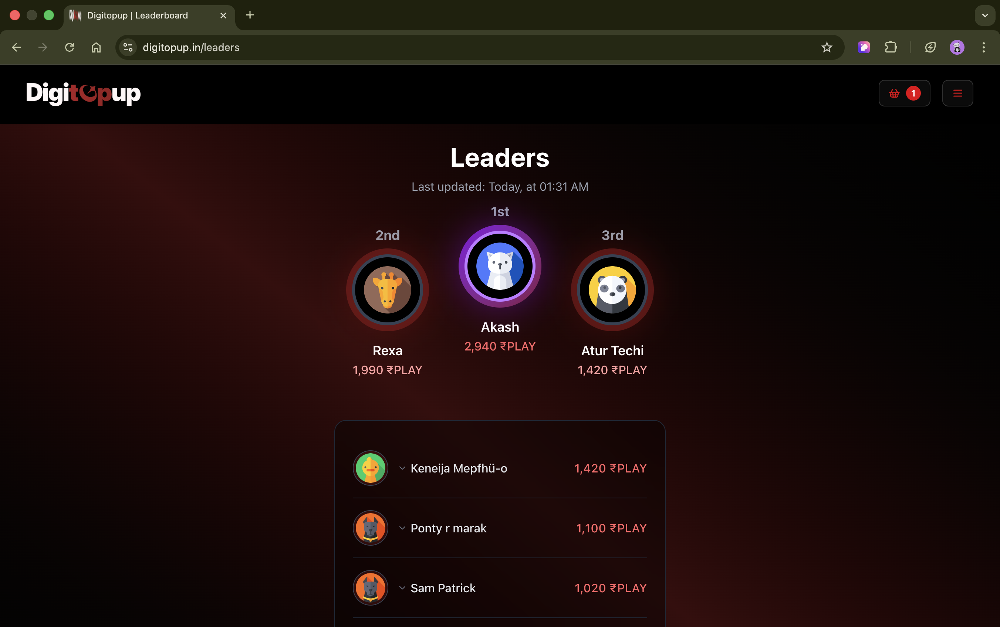
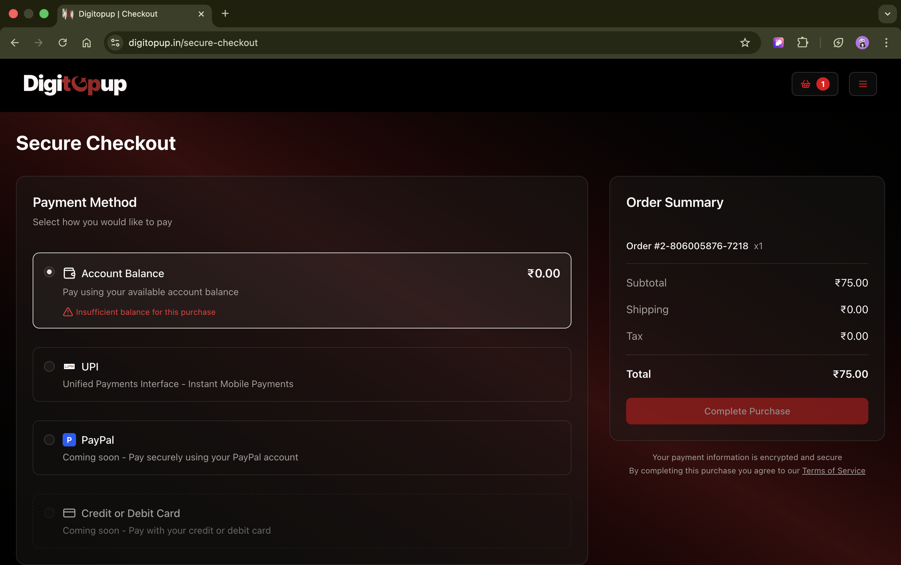
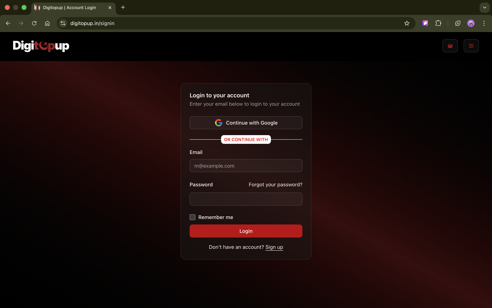

# Digitopup — Digital Top-Up System

Digitopup, created by **Arpan Patnaik**, is a proprietary e-commerce platform for digital content.
It specializes in offering secure and instant top-up services for popular mobile games, powered by
seamless integrations and a robust backend system.

---

## 🧑‍💻 Author

**Arpan Patnaik**  
📧 arpan.patnaik85@gmail.com  
🌐 [https://digitopup.in](https://digitopup.in)

---

## ⭐ Support Developer

If you like this project, please ⭐ the repo!, share it with your network!

---

## 📄 License

This project is licensed under the [Showcase](LICENSE).

---

## 📸 Screenshots

| Home                           | Leaders                      | Checkout                      | Login                      |
| ------------------------------ | ---------------------------- | ----------------------------- | -------------------------- |
|  |  |  |  |

---

## 🧠 Key Highlights

- 🪙 Secure Wallet-based Payment Flow
- 🔁 Retryable Transaction Processing
- 🧾 Detailed Transaction Logs & Reports
- 📈 Admin Panel for Game & API Management
- ☁️ Scalable Cloud Deployment (Docker + AWS)
